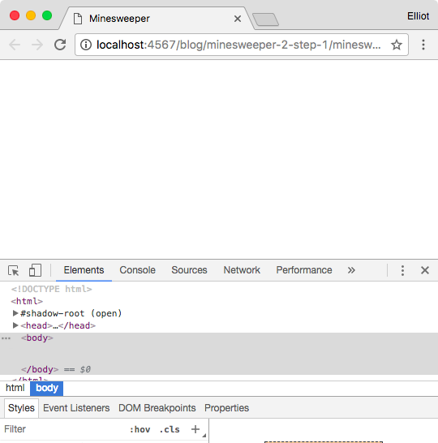
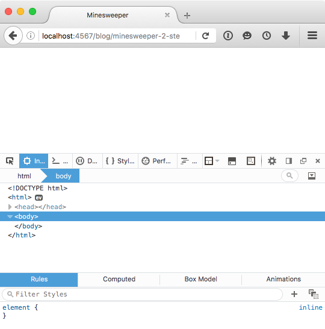
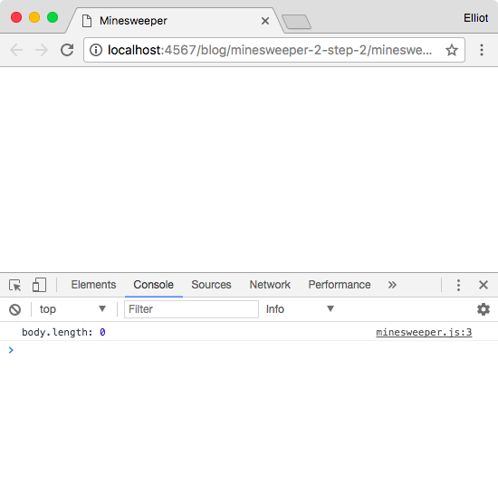
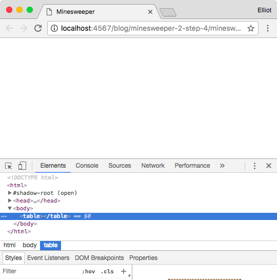

In the [previous post], we started building Minesweeper by creating the board
for the game using HTML and by giving the board its appearance using CSS.
[Here's][minesweeper-1]{:target="_blank"} what we have so far:

[minesweeper-1]: ../demos/minesweeper-1/minesweeper.html

<iframe src="../demos/minesweeper-1/minesweeper.html" border="0"></iframe>

[previous post]: ../minesweeper-1.html.md

### Got repetition?

In our little project, we have two files:

<ul class="file-tree">
  <li class="directory"><span>minesweeper/</span><ul>
      <li class="file">minesweeper.html</li>
      <li class="file">minesweeper.css</li>
    </ul>
  </li>
</ul>

Let's take another look at `minesweeper.html`:

``` html
<!DOCTYPE html>
<html>
  <head>
    <title>Minesweeper</title>
    <link rel="stylesheet" href="minesweeper.css">
    <script src="minesweeper.js"></script>
  </head>

  <body>
    <table id="board">
      <tr>
        <td></td>
        <td></td>
        <td></td>
        <td></td>
        <td></td>
        <td></td>
        <td></td>
        <td></td>
        <td></td>
      </tr>
      <tr>
        <td></td>
        <td></td>
        <td></td>
        <td></td>
        <td></td>
        <td></td>
        <td></td>
        <td></td>
        <td></td>
      </tr>
      <tr>
        <td></td>
        <td></td>
        <td></td>
        <td></td>
        <td></td>
        <td></td>
        <td></td>
        <td></td>
        <td></td>
      </tr>
      <tr>
        <td></td>
        <td></td>
        <td></td>
        <td></td>
        <td></td>
        <td></td>
        <td></td>
        <td></td>
        <td></td>
      </tr>
      <tr>
        <td></td>
        <td></td>
        <td></td>
        <td></td>
        <td></td>
        <td></td>
        <td></td>
        <td></td>
        <td></td>
      </tr>
      <tr>
        <td></td>
        <td></td>
        <td></td>
        <td></td>
        <td></td>
        <td></td>
        <td></td>
        <td></td>
        <td></td>
      </tr>
      <tr>
        <td></td>
        <td></td>
        <td></td>
        <td></td>
        <td></td>
        <td></td>
        <td></td>
        <td></td>
        <td></td>
      </tr>
      <tr>
        <td></td>
        <td></td>
        <td></td>
        <td></td>
        <td></td>
        <td></td>
        <td></td>
        <td></td>
        <td></td>
      </tr>
      <tr>
        <td></td>
        <td></td>
        <td></td>
        <td></td>
        <td></td>
        <td></td>
        <td></td>
        <td></td>
        <td></td>
      </tr>
    </table>
  </body>
</html>
```

As you can see, all of the HTML that displays the board is present in this file.
But we won't want to do this forever; we'll want to change this. Why? One reason
is that this code is repetitive -- we end up having to type `<td>` over and over
-- and we can easily instruct the computer to do this work for us instead. But
another reason is that we will need the ability to update the game's appearance
as the player progresses in the game. This involves updating the HTML structure
that makes up the game board as the game is being played, and the only way to do
with is with JavaScript.

### Planning our approach

At this point, we could jump right into code, but let's not do that quite yet.
Whenever we come across a problem that we'd like to solve, it's more helpful to
stop, take a step back, and write down a set of instructions, that *we* would
have to follow in order to fully solve that problem ourselves. First, just what
is our problem? Well, we need to come up with a way to build HTML elements and
place them onto the page, so that we end up with the same HTML that we coded by
hand. So if we took the HTML that we have right now and came up with a set of
instructions that the computer could follow to achieve the same code, what would
those instructions look like? Let's see:

* Build a `<table>` element
* Assign it an `id` of `board` (so that it retains the styling it has right now)
* Add the `<table>` to the `<body>` element (so that it appears on the screen)
* Build a `<tr>` element
* Add the `<tr>` to the `<table>`
* Build a `<td>` element
* Add the `<td>` element to the `<tr>`
* Build a `<td>` element
* Add the `<td>` element to the `<tr>`
* Build a `<td>` element
* Add the `<td>` element to the `<tr>`
* *... 6 more times ...*
* Build a `<tr>` element
* Add the `<tr>` to the `<table>`
* Build a `<td>` element
* Add the `<td>` element to the `<tr>`
* ...
{:.pseudocode}

Like the HTML we wrote earlier, there are lot of steps here that we're
repeating. It's quite a mouthful, too. What if we grouped together those
cumbersome, duplicate steps and indicated how many times we ought to repeat
them? Like this:

* Build a `<table>` element
* Assign it an `id` of `board`
* Add the `<table>` to the `<body>` element
* *Repeating the following for a total of 9 times:*
  * Build a `<tr>` element
  * Add the `<tr>` to the `<table>`
  * *Repeating the following for a total of 9 times:*
    * Build a `<td>` element
    * Add the `<td>` element to the `<tr>`
{:.pseudocode}

That's a lot better, isn't it? And as it turns out, we can convert these English
instructions -- what we commonly call *pseudocode* -- into real code easily,
because we have the same ability to repeat steps in JavaScript as we do in
English.

### Making room for our new code

Now that we have an idea of what the code will do, let's address another problem
we have: how do we build an HTML element in JavaScript? There are a couple of
different ways to do it, but in this post, we'll focus on a library called
[jQuery]. A library is code-in-a-box that we can download and use in any
project. This particular problem -- building HTML -- is very common in web
development, and jQuery was created specifically to solve it in a way that's
concise and elegant.

[jQuery]: https://jquery.org

The JavaScript community is constantly coming up with different tools to solve
problems in a different way. jQuery is over 10 years old now, and people in the
community have largely moved on to use newer libraries and techniques (which we
will cover in later posts). However, there are a large number of libraries that
still rely on jQuery and so it is important if you are at least somewhat
familiar with it.
{:.aside.aside--tip}

If you have never seen a line of jQuery code before, then you may wish to stop
and take some time to introduce yourself to the library. [Khan
Academy][]{:target="_blank"} has a great [video
series][jquery-video-series-john-resig]{:target="_blank"} that's very gentle and
bite-size. If that doesn't suit your fancy and you want something a little more
conversational, Chris Coyier (of [CSS Tricks][]{:target="_blank"} fame) has an
[equally good series][jquery-video-series-chris-coyier]{:target="_blank"} as
well.
{:.aside.aside--heads-up}

[Khan Academy]: https://www.khanacademy.org
[CSS Tricks]: https://css-tricks.com
[jquery-video-series-chris-coyier]: https://css-tricks.com/lodge/learn-jquery/01-welcome-to-the-learning-jquery-course/
[jquery-video-series-john-resig]: https://www.khanacademy.org/computing/computer-programming/html-js-jquery/jquery-intro/v/jquery-meet-the-inventor

First we need to install jQuery in our project. As jQuery is changed frequently,
new updates are assigned different version numbers. The latest update as of this
writing is version 3.2.1, although it may have changed by the time you read this
post. You can download jQuery [here][download-jquery]{:target="_blank"}. There
are several links on this page, but the one we are interested in starts with
"Download the uncompressed, development jQuery X.Y.Z" (where in place of "X.Y.Z"
you will see a version number). Click on this link and download the resulting
file to somewhere on your computer. Move it to your `minesweeper` directory and
rename the file to `jquery.js`.

[download-jquery]: https://jquery.com/download/

Next we need to add a new file in the project to hold the JavaScript that we are
about to write. We'll call it `minesweeper.js`.

That means our project now looks like:

<ul class="file-tree">
  <li class="directory"><span>minesweeper/</span><ul>
      <li class="file">minesweeper.html</li>
      <li class="file">minesweeper.css</li>
      <li class="file">jquery.js</li>
      <li class="file">minesweeper.js</li>
    </ul>
  </li>
</ul>

Finally, we need to update the HTML file to do two things. First, we need to
load jQuery along with our new JavaScript file. We can do this by adding
`script` tags that point to the new files we've just made and place them in the
`head` section. Second, if we're building the board HTML in code, that means
that the HTML we wrote by hand doesn't need to be there anymore, so we can get
rid of it:

``` html
<!DOCTYPE html>
<html>
  <head>
    <title>Minesweeper</title>
    <link rel="stylesheet" href="minesweeper.css">
    <script src="jquery.js"></script>
    <script src="minesweeper.js"></script>
  </head>

  <body>
    <!-- We will fill this in! -->
  </body>
</html>
```

### Writing the code

Great! Now that we've done all the prep work, we can dive into the JavaScript.
Take another look at the pseudocode we wrote earlier. The first three steps tell
us that we need to build a table element, give it an ID, and add it to the
`<body>` element. Let's *implement* these steps using jQuery by adding this code
to `minesweeper.js`:

``` javascript
const board = $("<table>").attr("id", "board");
const body = $(document.body);
body.append(board);
```

Now open up `minesweeper.html` in your browser (or [look at the
preview][minesweeper-2-step-1]{:target="_blank"}). If you don't see anything on
the page, that's perfectly normal! We need to look at the page from an HTML
perspective. If you're using Chrome or Firefox, there's a special pane commonly
called the "Developer Tools". You can bring up this pane by pressing
<kbd>Command</kbd>-<kbd>Option</kbd>-<kbd>I</kbd> if you're on a Mac, or
<kbd>Ctrl</kbd>-<kbd>Alt</kbd>-<kbd>I</kbd> if you're on Windows. Once you're
there, you should see a bunch of HTML elements that represent the page. Click on
the arrow next to the `<body>` element and you should see something like this
(Chrome and Firefox are shown below):
{:#developer-tools}

[minesweeper-2-step-1]: ../demos/minesweeper-2-step-1/minesweeper.html


{:class="centered-image"}


{:class="centered-image"}

Now, take a closer look here. **Do you notice anything strange about the
`<body>` element?** It doesn't have the `<table>` that we explicitly added to
the page, does it? That doesn't seem right. So what's going on here?

### A word about the jQuery API

In order to explain why, we have to take a brief side trail. (Don't worry --
we'll be back to the main path soon.)

If you go to your local home appliances store and walk into the kitchen section,
you will probably find a wide range of blenders. There are small,
cylinder-shaped blenders used for making smoothies and there are larger blenders
used for making soups. All of these can be used to chop or puree food into tiny
pieces, but why is one so cheap while another is so expensive? It all comes down
to the *design* of the blender. How big is the blender? What shape is the
pitcher? What are the shapes of the blades on the inside and what are they made
out of?

The design of a product dictates how that product looks and feels, but it also
dictates how people will use the product as well. Any product that you interact
with offers some kind of *interface* to do so. A blender may have dials or
switches that allow you to fine-tune the blender the way you want it. A blender
that allows you to do this more easily "feels" much different than a blender
that doesn't.

In the same way design is used to create physical objects, design is also used
to create code. Code that looks one way may also "feel" different than code that
looks another way. And because we use code to make things happen on the screen
or otherwise, code has an interface, too. Typically you'll hear it referred to
as the *API*.

jQuery has a concise and clear API. When the creator of jQuery, [John
Resig][]{:target="_blank"}, designed the library, he founded the API on two big
ideas:

[John Resig]: https://johnresig.com/

1. Whenever you want to do something involving HTML elements, there is one
   function that all of your code funnels through.
2. Most of the time, you will want to work with a group of HTML elements, not
   one element at a time.

jQuery was built specifically to manipulate and add behavior to elements. In
order to do this, you must establish a group of elements that you want to work
with. The API provides one primary function called `$` (yes, that's a single
dollar sign) to do so. This function is used everywhere. Here's an example of
jQuery code so you can see what I mean.

``` javascript
$("button").on("click", function () {
  $("form").submit();
  $("#container").hide();
  $("#container2").find(".accordion-tabs").hide();
  $("<p>Something bad happened!</p>").appendTo($(".error-message"));
});
```

jQuery code generally follows this pattern:

``` javascript
$(someValue)
  .someMethod(one, or, more, arguments)
  .maybeAnotherMethod();
```

As you see, we start by calling the `$` function. The value we pass to the
function depends on whether we want to build a new element from scratch or use
existing elements on the page:

* Passing a CSS selector to `$` will look for specific elements on the page and
  create a group from the results
* Passing an HTML element to `$` will create a group containing just that
  element
* Passing an HTML string will build an element and create a group containing
  just that element

How we call `$` exactly doesn't matter so much for right now. What's more
important to realize is that **`$` makes the assumption that you are working
with multiple elements, not just one**.

This assumption shows up all over the place in the jQuery API. What do I mean?
Well, let's say that we want to hide one button. It happens to have an ID of
`my-button`, so we could say:

``` javascript
$("#my-button").hide();
```

But now let's say we want to hide all of the buttons on the page. We could say:

``` javascript
$("button").hide();
```

Notice how whether we are working with one element or many elements, we still
use the same pattern. Many of the methods in the jQuery API work just like this.

Because of this assumption, it is possible when using `$` to end up in a
scenario where there are *no* elements to work on. For instance, let's say that we
want to hide all the buttons on the page as before, but there aren't any present
on the page to hide. What will happen if we run the following code?

``` javascript
$("button").hide();
```

You may expect jQuery to give you some kind of error, but that's not what
happens. Instead, it will silently skip over this line. It's sort of like
multiplying a number by zero. We have an action to perform -- hide all elements
-- but we have no elements to act on, since `$("button")` here represents an
empty group. Therefore, nothing will happen and jQuery will proceed as if this
line of code never existed.

### Debugging the problem

With that in mind, we can return to the problem we encountered previously. To
refresh your memory, we created a file `minesweeper.js` with the following
code in it:

``` javascript
const board = $("<table>");
const body = $(document.body);
body.append(board);
```

Then we discovered that the table that we built and placed on the screen wasn't
actually showing up. Now that you know more about how jQuery works, I can show
you why this is happening.

Let's run a little test. Modify the code in `minesweeper.js` to read:

``` javascript
const board = $("<table>");
const body = $(document.body);
console.log("body.length:", body.length);
body.append(board);
```

Open up `minesweeper.html` again in your browser (or [preview
here][minesweeper-2-step-2]{:target="_blank"}). Open up the Developer Tools
(remember, it's <kbd>Command</kbd>-<kbd>Option</kbd>-<kbd>I</kbd> or
<kbd>Ctrl</kbd>-<kbd>Alt</kbd>-<kbd>I</kbd>) as before, but this time go to the
Console tab (in Firefox it's an icon, but it's always the second tab). You
should see something like this:

[minesweeper-2-step-2]: ../demos/minesweeper-2-step-2/minesweeper.html


{:class="centered-image"}

What we've done is to ask jQuery how many elements are in the group that
`$(document.body)` creates, and then we've used `console.log` -- a handy tool
available in any browser -- to output this number to the screen, where it will
show up in the JavaScript console. What we *should* have seen was:

```
body.length: 1
```

But instead, the output is:

```
body.length: 0
```

What this means is that `$(document.body)` represents an empty group. This is
similar to the button example we showed in the previous section, but in this
case, how we are creating our group is a little different. Instead of searching
for elements on the page using a CSS selector, we are taking an existing element
-- `document.body` -- and giving it to jQuery so that we can then use jQuery to
add the board to the body. But if we have an empty group, then that leaves us
with only one conclusion: **the body must not exist at all!**

We can confirm this by changing `minesweeper.js` to read:

``` javascript
const board = $("<table>");
const body = $(document.body);
console.log("body.length:", body.length);
console.log("Body:", document.body);
body.append(board);
```

After [running this][minesweeper-2-step-3]{:target="_blank"}, we should see the
following output in the console:

```
body.length: 0
document.body: null
```

[minesweeper-2-step-3]: ../demos/minesweeper-2-step-3/minesweeper.html

### Order matters

Apparently, our JavaScript code is unable to recognize that the body element
is present. This seems odd, because our code is extremely simple and we are not
doing anything out of the ordinary.

So what are we missing? Well, as much as we would like to believe it, the
browser is not as smart as we think it is and will only follow the directions
that we give it in the order that we give them. By default, when the browser
loads a page, **it will read and run the HTML for that page from the top of the
file to the bottom.**

Let's take another look at our HTML file:

``` html
<!DOCTYPE html>
<html>
  <head>
    <title>Minesweeper</title>
    <link rel="stylesheet" href="minesweeper.css">
    <script src="jquery.js"></script>
    <script src="minesweeper.js"></script>
  </head>

  <body>
    <!-- We will fill this in! -->
  </body>
</html>
```

Look at where the `script` tags are and where the `body` element starts. Because
the browser will *parse* the HTML file from one line to the next, it will first
load the JavaScript, and then it will "see" the body. This means that when our
JavaScript code runs, the body has not come into existence yet!

So that's the problem. Now how do we fix it? Well, there are two ways. One
extremely common solution is to wrap all of our JavaScript code in a function --
so that it does not get run immediately -- then ask the browser to automatically
call the function, and thus run our code, when it has finished reading the
entire HTML file. Fortunately, jQuery has built-in support for doing just this.
We will need to replace our `minesweeper.js` file with the following:

``` javascript
$(function () {
  const board = $("<table>");
  const body = $(document.body);
  body.append(board);
});
```

Now when we [run this code][minesweeper-2-step-4]{:target="_blank"} and open the
Developer Tools, we will see that our table is present in the body. Perfect!

[minesweeper-2-step-4]: ../demos/minesweeper-2-step-4/minesweeper.html


{:class="centered-image"}

Now, even though this approach is popular and it will work, we aren't going to
use it. Why? As it turns out, we don't need to!

Think about the discovery we made above. If the browser loads our HTML file from
top to bottom, and if the body does not exist when our JavaScript is run, then
all we need to do is load that JavaScript *after* the start of the body.

So let's try changing our HTML file to the following:

``` html
<!DOCTYPE html>
<html>
  <head>
    <title>Minesweeper</title>
    <link rel="stylesheet" href="minesweeper.css">
  </head>

  <body>
    <script src="jquery.js"></script>
    <script src="minesweeper.js"></script>
    <!-- The new table will go here -->
  </body>
</html>
```

We can then change our JavaScript back to what it was before:

``` javascript
const table = $("<table>");
const body = $(document.body);
body.append(table);
```

Now if we [view the improved version][minesweeper-2-step-5]{:target="_blank"},
we should be able to see our `table` show up as before. This time, it appears
after the `script` tags. That's something else that can be cleaned up as it
looks a little out of order -- but it won't affect how the table actually
appears on screen, so we won't worry about it right now.

[minesweeper-2-step-5]: ../demos/minesweeper-2-step-5/minesweeper.html


{:class="centered-image"}

Placing the `script` tags at the end of the body as we've done not only makes
our JavaScript code cleaner, but it also has another advantage as well: it
decreases the perceived load time of the page. In loading JavaScript at the end
instead of the beginning, we are asking the browser to prioritize reading and
displaying the HTML over reading and running the JavaScript. This means that if
your JavaScript takes a long time to load for some reason, a visitor to your
page won't have to wait as long before they see the page -- the content will
appear immediately as soon as the browser sees it. Now, this doesn't make much
of a difference with our little game since there isn't a ton of JavaScript. But
if you are using JavaScript in a more sophisticated application, it's likely
that you'll be using many different little libraries. It adds up quickly --
enough to slow down load time by hundreds of milliseconds. This doesn't sound
like a lot, but with the rise of mobile devices, where Internet speed is slower
and your users' patience runs out more quickly, it's particularly important to
make sure that your site is performant, and moving the `script` tags to the end
is one simple best practice you can follow to do that.
{:.aside.aside--tip}

### Drawing the whole board

Whew! We've covered a lot in this post. Let's wrap it up by adding the remaining
code so that the entire board appears on-screen again.

Remember the pseudocode we wrote at the beginning? It went something like this:

* Build a `<table>` element
* Assign it an `id` of `board`
* Add the `<table>` to the `<body>` element
* *Repeating the following for a total of 9 times:*
  * Build a `<tr>` element
  * Add the `<tr>` to the `<table>`
  * *Repeating the following for a total of 9 times:*
    * Build a `<td>` element
    * Add the `<td>` element to the `<tr>`
{:.pseudocode}

We know how to do the first three steps, so what about the rest? First we'll
take our repeated sections and turn them into loops. Then we'll use jQuery to
add the other elements:

``` javascript
const board = $("<table>").attr("id", "board");
const body = $(document.body);
body.append(board);

for (let rowIndex = 0; rowIndex < 9; rowIndex++) {
  const row = $("<tr>");
  board.append(row);
  for (let columnIndex = 0; columnIndex < 9; columnIndex++) {
    const cell = $("<td>");
    row.append(cell);
  }
}
```

And [here's][minesweeper-2-step-6]{:target="_blank"} our final result. If you've
followed along this far, you should have a board that looks the same as the one
below. Great job!

[minesweeper-2-step-6]: ../demos/minesweeper-2-step-6/minesweeper.html

<iframe src="../demos/minesweeper-2-step-6/minesweeper.html"></iframe>

### What's next

Now we need to [display mines on the board][minesweeper-3].

[minesweeper-3]: ./minesweeper-3.html.md.erb

<div class="nav-wrapper">
  <div class="nav nav--left">
    <a href="./minesweeper-1.html.md">← Go back</a>
  </div>
  <div class="nav nav--right">
    <a href="./minesweeper-3.html.md.erb">Continue →</a>
  </div>
</div>
